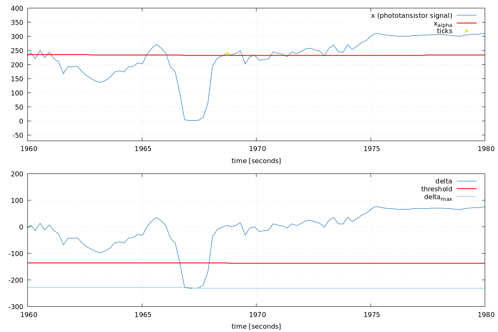
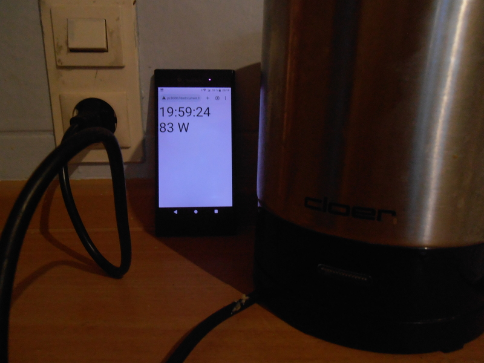

# Energy Monitor Project

The goal is to (have fun and) monitor and log the total electric energy consumption in my house. The vision: I stand in my kitchen, turn on the 2000 W kettle on, and see on my smartphone that 2000 more Watts are drawn, in real-time. 

The requirements are the following:
1. The electricy meter of my house is an old, analog, "Ferraris" meter. It has a rotating metallic disc with a mark on its edge, as shown [here](https://de.wikipedia.org/wiki/Ferraris-Z%C3%A4hler#/media/Datei:ElectricityMeterMechanism.jpg). We can estimate the speed of rotation of the disc by *detecting this mark*.
2. We don't want to adjust any parameter manually. The program should adapt its parameter autonomously (*self-calibration*).
3. The electricy meter is in the entrance of the house, at a place where there is no power outlet. Therefore, the whole system has to run on batteries and must be **low-power**. Low-power can be achieved putting the microcontroller in deep-sleep most of the time.
4. The sensor data should be sent *per WLAN* to a server (on a raspberry pi).

#### First Attempts With ESP8266 And TRCT5000

As probably 99% of humanity, I started my project googling `Ferraris electricy meter arduino`. (That's a mistake. Don't do this, don't google.) In the first result (and many others), the mark is detected with a ready-to-use infrared [TRCT5000](https://www.az-delivery.de/products/linienfolger-modul-mit-tcrt5000-und-analog-ausgang) arduino module. This module has (1) an infrared LED, and (2) a phototransistor that measure the (reflected) light.  Assuming the mark reflects infrared light differently than the rest of the disc, we could detect the mark. And since we need WLAN connectivity, it seems obvious to try with a ESP8266 first.
Unfortunately, my attempt with the TRCT500 with ESP8266 failed because the signal-to-noise ratio at the ADC was not good enough to detect the mark reliably. Moreover, the wake-up time of ESP8266 after deep-sleep is quite long (300ms, if I remember well), which make a low-power operation difficult.

#### Second Attempt With ATmega328P And Custom Phototransistor

The second design is based around an ATmega328P. It includes a self-made sensor and a ESP-01 module that transmits the data when needed (that is, when the energy consumption changes by certain amount).


#### The Sensor

I suspected the TRCT5000 failed because the infrared light is not particularly suitable for my Ferraris meter. Its mark is red, and the rest of the disc is metallic. Sending red light on it would result in reflected red light, with or without the mark, so the phototransistor would deliver the more or less the same signal, with or without the mark, offering a poor signal to detect the mark. 


I ordered a bunch of LED and phototransistor with other wavelengths. I could get a most contrast with the white LED and SFH 309-4 phototransistor. After tweaking the orientation of the LED and phototransistor, I could get a nice, clean signal. The orientation seems to play a significant role, maybe because the plastic front cover of the Ferraris meter reflects the light. 

LED turned off (left) and on (right):


Phototansistor ADC output (noted `x` in the sequel)


_Note_: The influence of ambient light can be compensated by removing an offset to the adc output:
```
adc - offset
```
where `offset` is the adc output when the LED is turned off.

#### Self-Calibration

To find the threshold, we exploit that there is an abrupt change in the phototansistor signal when the mark passes. So we use:
- A simple low-pass filter 
```
xalpha = alpha_1 * xalpha + (1 - alpha_1) * x;
```
Since the mark is only on a short section of the disc, `xalpha` represents the phototransistor signal level when the mark is not in front of the sensor. (The constant `alpha_1` is hard-coded.)
- The difference `delta` between `x` and `xalpha` is large (and below zero) when the mark passes:
```
delta = x - xalpha;
```

Now the question: how large is "large" ? 
Assuming we know the maximum value taken by `delta`, noted `delta_max`, `delta` would be large enough when it is closer to `delta_max` than `delta`.

In details, we track the mean and the maximum value of delta, `delta_mean` and `delta_max`, as: 
- `delta_mean`
```
delta_mean = alpha_2 * delta_mean + (1 - alpha_2) * delta;
```
The constant `alpha_2` is hard-coded.
```
delta_max = min(delta,alpha_3 * delta_max + (1 - alpha_3) * delta_mean);
```
The constant `alpha_3` is hard-coded, larger than `alpha_2`. `min()` is used get the largest of negative values. See the source code `detection.cpp` for details.

The graph below shows the values and ticks when the mark is detected:


Zoom on the short spike, the mark passed fast, the energy consumption was around 2000W:


### Low-Power

The main power consumer of the circuit is the LED. It should be turned on as less as possible, just enough to detect the mark when it passes in front on the sensor, and then turned off again. The frequency with which the LED is turned on sets a limit on the speed of rotation of the mark: Assuming we turn the LED on every 100 ms, we might miss it if it remains less than 100ms in front of the sensor. 

### Build Instructions

Assuming the arduino toolchain is configured in `<path>/embedded/cmake/arduino/toolchain.cmake`, build with:
```
BUILDDIR=/tmp/build/atmega
mkdir -p $BUILDDIR 
cmake -DCMAKE_TOOLCHAIN_FILE=$DIR/embedded/cmake/arduino/toolchain.cmake -B $BUILDDIR 
make -j3 -C $BUILDDIR
```
Please adapt the toolchain file for your setup.
Similarly, the ESP8266 is build with:
```
BUILDDIR=/tmp/build/esp8266
mkdir -p $BUILDDIR 
cmake -DCMAKE_TOOLCHAIN_FILE=$DIR/embedded/cmake/esp8266/toolchain.cmake -B $BUILDDIR 
make -j3 -C $BUILDDIR
```
Disclaimer: the build instructions are configured for my setup, that looks like:
```
/opt/arduino/ArduinoCore-avr-1.8.2
/opt/arduino/libraries
/opt/arduino/libraries/LowPower
etc.
```

### The Results

Kettle turned off. 


Kettle turned on, 30 seconds later.


Kettle turned on, 30 seconds later.

