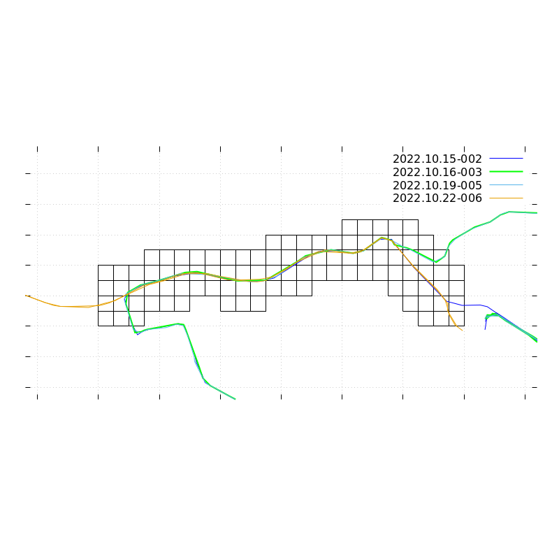

# GPX Segments Tool

## What does it do ?

The tool parses the GPX files from a directory. 
It cleans the content, because:
- One route might be present in several gpx files. This happens if you don't remove the files from the GPS device after a backup.
- Parts of the GPS data is noise. The device is typically turned on *before* the start of a tour and turned off *after* its end. These parts of the data should be removed. This is done based on the coordinates of your home, considering the data around this point is noise. (TODO: fix that.)

Then the tool classifies the tour into three categories: running, cycling, and "none". The classification is based on the average speed.

For each category, the tool tries to find out the segments in your data where you have been mutliple times. It will find short segments which have been visited many times, and larger segments (which have been less visited). It displays some statistics about the segments.

## How To Use

### Prerequisite

python modules:
- gpxpy
- pyproj

The tools general gnuplot files in `/tmp` for visualization.

You need to have the GPX files you want to analyse in one directory, which will be searched recursively for `Track_*.gpx` and `Current.gpx` files (the way my etrex names the tracks).

## Example

Assuming i have some GPS files under `~/tracks` in my home directory:
```
$ python3 main.py ~/tracks/
read files..
clean tracks..
categorizing..
OK
# category cycling
2022.10.16-002  | 08:49 |  25.7 km | 01:03 | 24.4 kmh |
2022.10.19-004  | 12:52 |  25.7 km | 01:00 | 25.6 kmh |
2022.10.15-001  | 15:49 |  37.7 km | 03:11 | 11.8 kmh |
2022.10.22-005  | 17:26 | 342.2 km | 25:29 | 13.4 kmh |
total cycling   :  431.3 km | 30.7h
-------------------------------------------------------
2022.10.15-001  | 15:49 |   2.1 km | 00:25 |  5.0 kmh |
2022.10.15-001  | 17:01 |   0.6 km | 00:06 |  5.0 kmh |
2022.10.15-001  | 18:28 |   1.4 km | 00:02 | 29.1 kmh |
2022.10.22-005  | 17:26 |   2.1 km | 00:06 | 20.0 kmh |
2022.10.22-005  | 18:49 |   2.1 km | 00:06 | 19.2 kmh |
/tmp/cycling-segment-0.gnuplot #visits:  2
------------------------------------------------------------
2022.10.15-001  | 15:49 |   1.2 km | 00:18 |  4.0 kmh |
2022.10.15-001  | 17:01 |   0.6 km | 00:06 |  5.0 kmh |
2022.10.15-001  | 18:28 |   1.3 km | 00:02 | 29.0 kmh |
2022.10.16-002  | 09:47 |   1.2 km | 00:02 | 30.3 kmh |
2022.10.19-004  | 13:47 |   1.2 km | 00:02 | 29.0 kmh |
2022.10.22-005  | 17:26 |   1.2 km | 00:03 | 18.5 kmh |
2022.10.22-005  | 18:53 |   1.2 km | 00:02 | 24.8 kmh |
/tmp/cycling-segment-1.gnuplot #visits:  4
------------------------------------------------------------

# category running
2022.10.17-003  | 12:26 |   6.5 km | 00:43 |  9.0 kmh |
2022.10.11-000  | 16:53 |   6.7 km | 00:46 |  8.6 kmh |
total running   :   13.3 km |  1.5h
-------------------------------------------------------
2022.10.11-000  | 16:53 |   1.7 km | 00:11 |  9.0 kmh |
2022.10.11-000  | 17:23 |   2.4 km | 00:17 |  8.4 kmh |
2022.10.17-003  | 12:26 |   1.8 km | 00:11 |  9.2 kmh |
2022.10.17-003  | 12:55 |   2.4 km | 00:15 |  9.4 kmh |
/tmp/running-segment-0.gnuplot #visits:  2
------------------------------------------------------------
2022.10.11-000  | 17:10 |   0.5 km | 00:03 |  8.7 kmh |
2022.10.17-003  | 12:49 |   0.4 km | 00:02 |  8.3 kmh |
/tmp/running-segment-1.gnuplot #visits:  2
------------------------------------------------------------
```

### Category statistics

Each tour is on one line with
- date and a running counter (set in cleanup, see above, TODO: remove it)
- start time
- distance
- average speed

```
# category cycling
2022.10.16-002  | 08:49 |  25.7 km | 01:03 | 24.4 kmh |
2022.10.19-004  | 12:52 |  25.7 km | 01:00 | 25.6 kmh |
2022.10.15-001  | 15:49 |  37.7 km | 03:11 | 11.8 kmh |
2022.10.22-005  | 17:26 | 342.2 km | 25:29 | 13.4 kmh |
total cycling   :  431.3 km | 30.7h
```

### Segment statistics

Each tour might enter the segment area and leave it several times, that is why there are multiple lines with the same tour. Each line has_
- date and a running counter (set in cleanup, see above, TODO: remove it)
- enter time
- distance
- time spent inside the segment
- average speed inside the segment

```
-------------------------------------------------------
2022.10.15-001  | 15:49 |   2.1 km | 00:25 |  5.0 kmh |
2022.10.15-001  | 17:01 |   0.6 km | 00:06 |  5.0 kmh |
2022.10.15-001  | 18:28 |   1.4 km | 00:02 | 29.1 kmh |
2022.10.22-005  | 17:26 |   2.1 km | 00:06 | 20.0 kmh |
2022.10.22-005  | 18:49 |   2.1 km | 00:06 | 19.2 kmh |
/tmp/cycling-segment-0.gnuplot #visits:  2
```

### Images
```
$ gnuplot /tmp/cycling-segment-0.gnuplot
```


